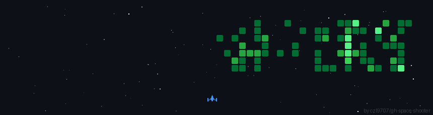

<h3 align = "center"> Hi, I'm Hamza 👋 </h3>

# 🔥 Featured Projects:
Check out some of my projects, with many more to come

### Code Security Analyzer

### Hollow Purple - Computer Vision Project  [WIP]

### Chaos Kitchen (SuperCell AI Hack 2026)

### Galactic Attack 

### Monte Carlo Simulation (EU)

### AURA E commerce (Stripe and Vercel Pract)

### Lahti Green Infrastructure (FCG Hackathon 2025)

## 🌐 Socials:

  
# 💻 Tech Stack & Tools:
<b> Languages/Engines </b>:  
         

<b> Game Development, Video Editing, Productivity etc.: </b>:               
  

# 📊 GitHub Stats:

 
 

## 📃 GitHub Return:

[<b>Browse through the repositories as you wish. </b> 😀](https://github.com/MHamzaS45?tab=repositories)

  

  

